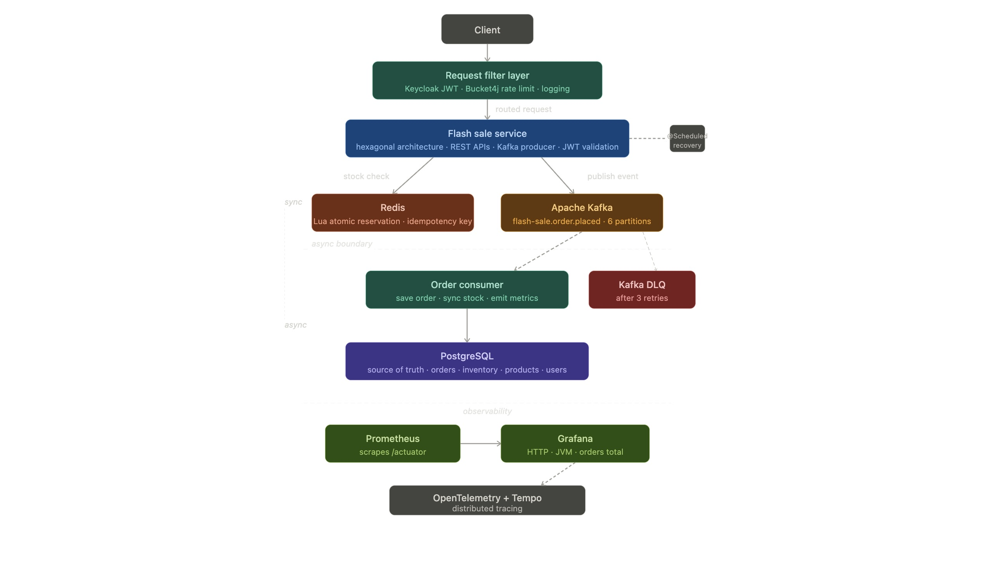
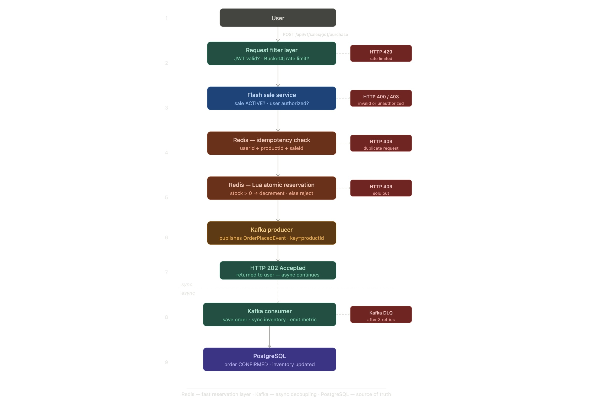

# High-Concurrency Flash Sale System

> A production-oriented high-concurrency backend validated under 10,000+ concurrent simulated flash sale requests using Redis Lua-based atomic inventory control, Kafka asynchronous processing, fault-tolerant recovery mechanisms, and distributed observability.


---

#  Problem Statement

Flash sale systems create one of the hardest backend engineering problems: thousands of users attempting to purchase limited inventory simultaneously.

Without careful system design, systems typically fail due to:

- Overselling caused by race conditions
- Database overload during traffic spikes
- Duplicate order creation during retries
- Inconsistent state during failures
- Infrastructure instability under burst traffic

This project explores how production systems solve concurrency, asynchronous scalability, fault tolerance, recovery orchestration, and observability under high load.

---

# ️ Architecture

> **Style:** Modular Monolith · Hexagonal Architecture (Ports & Adapters) · Event-Driven

## System Architecture





## High-Level Flow

```text
Client
  │
  ▼
Spring Boot API
  │
  ▼
Redis Lua Script
(atomic inventory reservation)
  │
  ▼
Kafka Producer
(OrderPlacedEvent)
  │
  ▼
Kafka Broker (6 Partitions)
  │
  ▼
Kafka Consumer
  ├──► PostgreSQL
  ├──► Retry Logic
  └──► Dead Letter Queue
```

---

#  Reliability & Distributed Systems Features

- Redis Lua-based atomic inventory reservation
- Kafka asynchronous order processing
- Producer & consumer retry workflows with DLQ handling
- Compensation-based stock recovery mechanisms
- Idempotent event processing and duplicate-safe recovery
- Redis recovery using AOF + database rebuild strategy
- Kafka partitioning for ordered event processing
- Redis cache-aside optimization for hot-path sale data
- Bucket4j rate limiting for infrastructure protection
- Spring Scheduler-based background recovery jobs
- OpenTelemetry distributed tracing
- Prometheus + Grafana monitoring & alerting

---

#  Engineering Challenges Solved

| Challenge | Solution |
|---|---|
| Overselling under concurrency | Redis Lua atomic execution |
| Database bottlenecks | Kafka async buffering |
| Duplicate orders | Idempotency + DB constraints |
| Producer publish failures | Retry queue + DLQ |
| Consumer failures | Kafka retry + DLQ |
| Duplicate event processing | Event tracking table |
| Redis restart recovery | AOF + DB rebuild strategy |
| High latency under load | Redis cache optimization |
| Burst traffic protection | Bucket4j rate limiting |
| Distributed tracing | OpenTelemetry + Tempo |

---

#  Purchase Flow

## Purchase Flow Diagram



## Flow Summary

1. User submits purchase request
2. User authenticated via Keycloak
3. Redis Lua script atomically reserves inventory
4. `OrderPlacedEvent` published to Kafka
5. API immediately returns `HTTP 202 Accepted`
6. Kafka consumer processes order asynchronously
7. Order persisted to PostgreSQL
8. Recovery workflows preserve consistency during failures

---

#  Failure Handling & Recovery

The system includes multiple recovery and compensation mechanisms to preserve consistency during failures.

## Recovery Features

- Producer retry queue with Redis-backed DLQ
- Kafka consumer retry + Dead Letter Queue (DLQ)
- Compensation-based stock recovery workflows
- Duplicate-safe recovery mechanisms
- Idempotent event processing guarantees
- Pending order expiration handling
- Scheduler-based background recovery jobs

> Detailed recovery workflows available in `/docs/recovery-strategy.md`.

---

#  Redis Recovery Strategy

Redis is treated as a high-performance concurrency layer — not the source of truth.

Recovery strategy includes:

- Redis AOF persistence
- Automatic rebuild on startup
- Recalculation using persisted order data

```text
remaining_stock = initial_stock - confirmed_orders
```

This ensures inventory consistency even after Redis restart or cache loss.

---

#  Performance Validation

Load testing using k6 simulated flash-sale traffic with `8,000+` concurrent purchase requests on local infrastructure.

## Validated Scenarios

- Stress testing
- Spike testing
- Burst traffic simulation
- Flash-sale start concurrency validation
- Out-of-stock race condition testing
- Idempotency verification

## Key Results

- Zero overselling observed under concurrent purchase attempts
- Stable asynchronous throughput during burst traffic
- Kafka buffered burst traffic effectively
- Redis caching significantly reduced hot-path latency
- Failure recovery workflows prevented inconsistent order states

Detailed performance analysis is available in `/docs/load-testing.md`.

---

#  Observability & Monitoring

The system integrates observability tooling for metrics collection, distributed tracing, infrastructure monitoring, and performance analysis.

## Stack

- Prometheus — metrics collection
- Grafana — dashboard visualization and alerting
- OpenTelemetry — distributed tracing instrumentation
- Tempo — distributed trace aggregation


Monitored metrics include:

- P95 latency
- Request throughput
- Error rates
- JVM memory usage
- Infrastructure resource utilization

## Distributed Tracing

Distributed tracing was used to analyze asynchronous request flow and identify latency bottlenecks during high-concurrency scenarios.

## Alerting

Grafana alerting configured for:

- Memory usage > 80%
- Latency > 2 seconds

Additional observability details are available in `/docs/observability.md`.

---

#  Testing Strategy

## Coverage

- 40+ unit and integration tests
- End-to-end tests
- Failure scenario validation
- Recovery workflow testing

## Tooling

- JUnit
- Mockito
- Testcontainers
- JaCoCo coverage reporting

---

#  Authentication & Authorization

Authentication and authorization handled using:

- Keycloak
- Spring Security
- JWT-based access control

---

#  Tech Stack

| Category | Technology |
|---|---|
| Language | Java 21 |
| Framework | Spring Boot 3.x |
| Architecture | Hexagonal Architecture |
| Security | Keycloak + Spring Security |
| Database | PostgreSQL |
| Cache & Concurrency | Redis + Lua |
| Messaging | Kafka + Zookeeper |
| Observability | Prometheus + Grafana |
| Distributed Tracing | OpenTelemetry + Tempo |
| Rate Limiting | Bucket4j |
| Infrastructure as Code | Terraform |
| Containerization | Docker + Docker Compose |
| Testing | JUnit, Mockito, Testcontainers |
| Load Testing | k6 |
| Cloud Infrastructure | AWS EC2 + RDS + ElastiCache + ECR |

---

#  Infrastructure & Deployment

Infrastructure provisioned using Terraform-based Infrastructure as Code (IaC).

## Infrastructure Components

- AWS EC2
- AWS RDS PostgreSQL
- AWS ElastiCache Redis
- AWS ECR
- Kafka + Zookeeper cluster
- Dockerized services

> Deployment details available in `/docs/deployment.md`.

---


#  Project Structure

```text
src/
└── main/
    └── java/
        └── com.flashsale.ordersystem/
            ├── order/
            │   ├── adapter/
            │   ├── domain/
            │   ├── port/
            │   ├── scheduler/
            │   └── service/
            │
            ├── product/
            ├── sale/
            ├── shared/
            └── user/

docs/
├── architecture.md
├── recovery-strategy.md
├── load-testing.md
├── observability.md
├── deployment.md
└── architecture-decision.md
```

---

#  Documentation

| Document | Description |
|---|---|
| `docs/architecture.md` | System architecture and request-processing flow |
| `docs/architecture-decisions.md` | Key architectural and technology decisions |
| `docs/recovery-strategy.md` | Failure handling, retries, and recovery workflows |
| `docs/load-testing.md` | Load testing scenarios and performance analysis |
| `docs/observability.md` | Monitoring, tracing, dashboards, and alerting |
| `docs/deployment.md` | Infrastructure and deployment architecture |

---

#  Getting Started

## Prerequisites

- Java 21
- Docker
- Docker Compose

## Clone Repository

```bash
git clone https://github.com/Anzyll/flash-sale-order-system.git

cd flash-sale-order-system
```

## Start Services

```bash
docker compose up --build -d
```

## API Documentation

Swagger/OpenAPI documentation:

```text
http://localhost:8000/swagger-ui/index.html
```

---

#  Future Improvements

- Kubernetes-based orchestration and scaling
- Multi-instance deployment for higher availability

---

# ️ Known Limitations

- Single-node Kafka and Redis deployment without clustering or replication
- Eventual consistency due to asynchronous processing
- AWS Free Tier infrastructure constraints

---

#  Author

**Muhammed Anzil M**

Backend Developer interested in distributed systems, high-concurrency backend engineering, event-driven architecture, and scalable Java systems.

---

#  License

This project is licensed under the MIT License. See the [LICENSE](LICENSE) file for details.