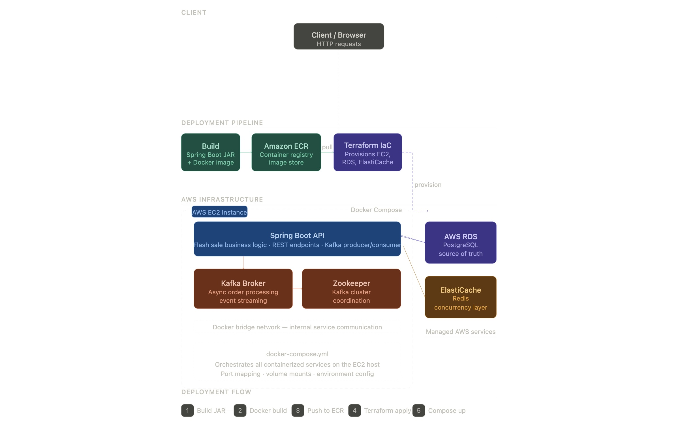

# 🌍 Deployment & Infrastructure

This document describes the deployment architecture and infrastructure setup used in the Flash Sale System.

---

# 📌 Infrastructure Overview

Infrastructure provisioning is managed using:

- Terraform Infrastructure as Code (IaC)
- Docker containerization
- AWS cloud services

The deployment architecture combines application, messaging, persistence, and caching components within a containerized environment.

---

# 🧭 Deployment Architecture



---

# ☁️ AWS Components

| Component | Purpose |
|---|---|
| EC2 | Hosts containerized application services |
| RDS PostgreSQL | Persistent database |
| ElastiCache Redis | High-performance concurrency layer |
| ECR | Docker image registry |

---

# 🐳 Containerized Services

Services are orchestrated using Docker Compose.

Core services include:

- Spring Boot API
- Kafka
- Zookeeper
- PostgreSQL
- Redis

---

# 🚀 Deployment Workflow

```text
Build Application
        │
        ▼
Build Docker Image
        │
        ▼
Push Image to Amazon ECR
        │
        ▼
Provision Infrastructure using Terraform
        │
        ▼
Pull Images on EC2
        │
        ▼
Start Services using Docker Compose
```

---

# 📊 Observability

The system integrates:

- Prometheus
- Grafana
- OpenTelemetry
- Tempo

for monitoring, tracing, and bottleneck analysis during load testing and concurrency validation.

Due to AWS Free Tier resource constraints, observability tooling was primarily used in the local development environment.

---

# ⚠️ Current Limitations

The current deployment setup is intentionally simplified for experimentation and architecture validation.

Current limitations include:

- Single-node Kafka deployment
- Single Redis node
- Single EC2 deployment
- Limited horizontal scaling

---

# 🚧 Future Improvements

Potential future improvements include:

- Kubernetes orchestration
- Multi-instance deployment
- Kafka cluster replication
- Redis high availability
- CI/CD automation

---

# 📌 Summary

The infrastructure combines:

- Terraform provisioning
- Docker containerization
- AWS-managed persistence and caching
- Kafka-based asynchronous processing

to provide a reproducible deployment architecture for high-concurrency flash-sale workloads.