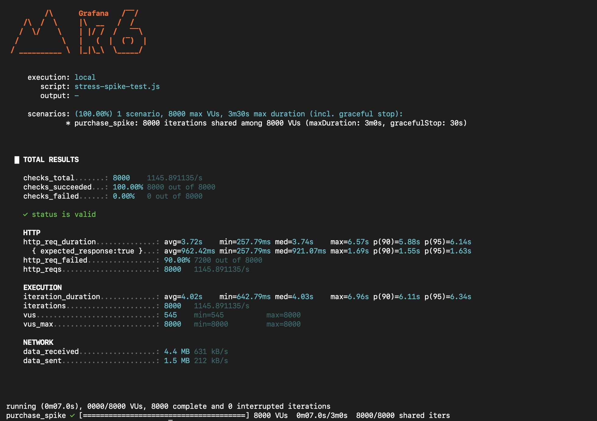

# 📈 Load Testing & Performance Analysis

This document describes the load-testing strategy, validated scenarios, bottleneck analysis, and performance optimizations used in the Flash Sale System.

Load testing was performed to validate:

- High-concurrency request handling
- Inventory correctness
- Burst traffic behavior
- Asynchronous processing stability
- Retry workflow correctness
- Infrastructure bottlenecks
- Latency behavior under load

---

# 📌 Testing Overview

The system was tested using **k6** to simulate flash-sale traffic under high concurrency.

The primary objective was not only throughput validation, but also correctness validation during concurrent purchase attempts.

Key validation goals included:

- Atomic inventory reservation
- Concurrent request handling
- Event-processing stability
- Duplicate-safe processing
- Infrastructure protection
- Observability-driven bottleneck analysis

---

# 🧪 Test Environment

Load testing was performed on local infrastructure using Dockerized services.

## Environment Components

- Spring Boot API
- PostgreSQL
- Redis
- Kafka + Zookeeper
- Prometheus + Grafana
- OpenTelemetry + Tempo

---

## Kafka Configuration

Kafka was configured using:

```text
6 partitions
```

to improve parallel event-processing throughput.

---

## Infrastructure Constraints

Testing was intentionally performed on local infrastructure to observe realistic bottlenecks under constrained resources.

Observed limitations included:

- CPU saturation
- JVM thread pressure
- Docker resource limits
- Increased latency during retry-heavy traffic

The objective was architectural validation and bottleneck analysis rather than production-scale benchmarking.

---

# ⚡ Load Testing Scenarios

The following scenarios were validated using k6.

---

# 1. Stress & Spike Testing

A stress test gradually increased concurrent traffic from:

```text
100 → 3000 concurrent users
```

This scenario was used to analyze:

- Throughput stability
- Resource utilization
- Consumer processing behavior
- Latency degradation patterns
- Infrastructure bottlenecks

The test helped identify system limits under sustained concurrent load.

---

# 2. Burst Traffic Validation

A burst-concurrency scenario simulated approximately:

```text
~8000 concurrent purchase requests
```

This validated the system’s ability to absorb sudden flash-sale traffic spikes.

---

## Validated Behaviors

- Stable asynchronous processing
- Kafka traffic buffering
- Inventory correctness
- Consistent event processing
- Redis concurrency handling

Kafka successfully buffered burst traffic while reducing direct pressure on the database layer.

---

# 3. Out-of-Stock Race Condition Testing

A dedicated race-condition validation scenario simulated:

```text
5000 concurrent purchase attempts
1 inventory item
```

This specifically validated correctness during near-zero inventory conditions.

---

## Validated Behaviors

- Redis Lua atomic execution
- Concurrent inventory correctness
- Negative inventory prevention
- Duplicate inventory allocation prevention

No inconsistent inventory state was observed during testing.

---

# 4. Flash-Sale Start Validation

A dedicated sale-start scenario validated behavior before sale activation time.

---

## Validation Goal

Ensure purchase requests arriving before the configured sale-start timestamp are rejected correctly under concurrent traffic conditions.

---

## Validated Behaviors

- Sale timing enforcement
- Request validation correctness
- Consistent rejection handling during traffic bursts

All requests before the configured sale start time were rejected successfully.

---

# 5. Retry Storm & Infrastructure Stability Testing

Dedicated retry-heavy traffic scenarios were used to analyze infrastructure stability under excessive repeated requests.

---

## Observed Behaviors

Under retry-heavy concurrent traffic:

- CPU utilization increased significantly
- Thread contention became visible
- Request latency increased under sustained retries

These findings were later used to improve:

- Redis caching
- Rate limiting
- Retry workflow stability

---

# 🚀 Redis Cache Optimization

One major bottleneck discovered during testing was repeated sale-data fetching under high concurrency.

---

## Initial Observation

Under heavy concurrent traffic:

```text
sale-data latency ≈ 600–800 ms
```

This introduced unnecessary pressure on the application and persistence layers.

---

## Optimization

A Redis cache-aside strategy was introduced for hot-path sale data.

---

## Result

After Redis caching optimization:

```text
sale-data latency ≈ 3–4 ms
```

This significantly improved:

- API responsiveness
- Throughput stability
- Infrastructure efficiency
- Concurrent request performance

---

# 🚦 Rate Limiting Impact

Load testing revealed that excessive retries and repeated requests increased:

- Infrastructure pressure
- Thread contention
- Latency instability

To stabilize traffic behavior, Bucket4j-based rate limiting was introduced.

Current policy:

```text
5 requests / 10 seconds
```

---

## Result

Rate limiting reduced:

- Retry storms
- Infrastructure overload
- Latency spikes during burst traffic

while improving overall system stability.

---

# 📊 Observability During Testing

Distributed observability tooling was heavily used during performance analysis.

## Stack

- Prometheus
- Grafana
- OpenTelemetry
- Tempo

---

## Metrics Monitored

- API latency
- Throughput
- Error rates
- JVM memory usage
- CPU utilization
- Kafka consumer lag
- Container resource utilization

---

## Distributed Tracing

OpenTelemetry tracing was used to analyze:

- Request lifecycle behavior
- Kafka event flow
- Asynchronous processing latency
- Retry behavior
- Bottlenecks during concurrency spikes

Tracing data was heavily used during optimization and bottleneck investigation.

---

# 📈 Load Testing Results

## k6 Load Test



---

# 📌 Key Engineering Outcomes

Load testing validated:

- Stable asynchronous event processing
- Reliable Kafka traffic buffering
- Retry-safe order processing
- Distributed recovery workflow stability
- Redis Lua atomic correctness
- Cache optimization effectiveness
- Infrastructure bottleneck visibility

---

# ⚠️ Testing Limitations

Testing was performed using local infrastructure and Dockerized services.

Results were constrained by:

- Local hardware limitations
- Single-node deployment setup
- Limited infrastructure scaling

The testing objective was architectural validation and operational analysis rather than maximum production-scale benchmarking.

---

# 📌 Summary

Load testing was used not only for throughput validation, but also for correctness validation during concurrent flash-sale traffic.

The testing process helped validate:

- Inventory correctness
- Retry safety
- Infrastructure stability
- Burst traffic handling
- Observability workflows
- Cache optimization effectiveness
- Infrastructure protection mechanisms

while also identifying bottlenecks that guided further optimization work.