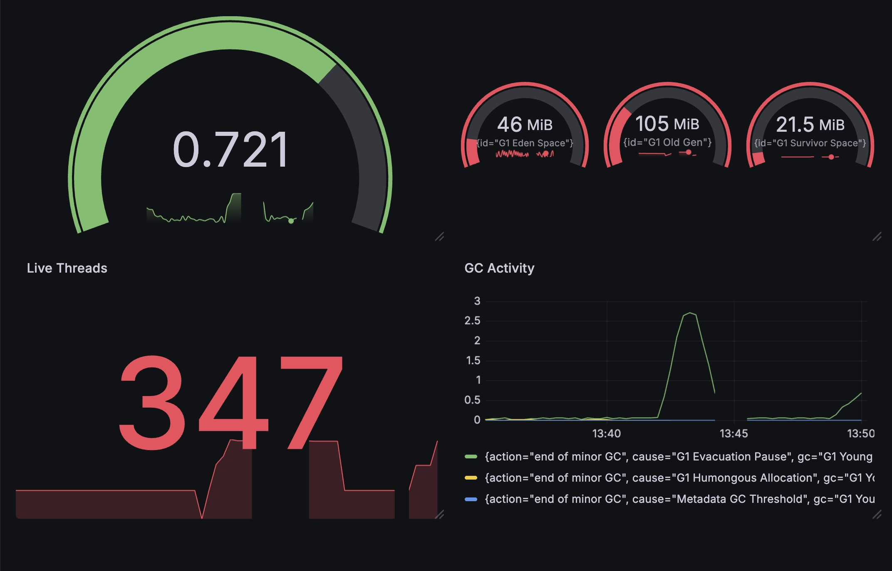
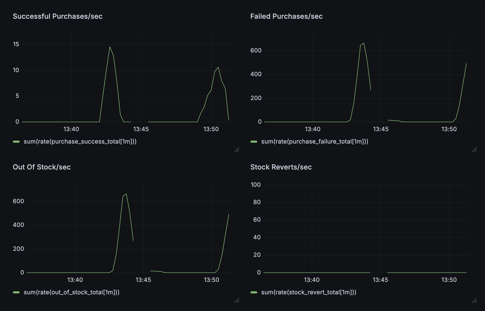
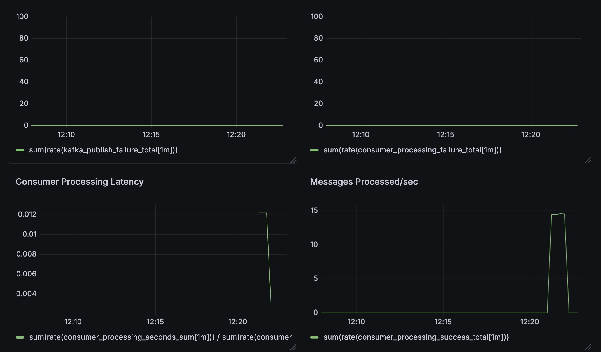
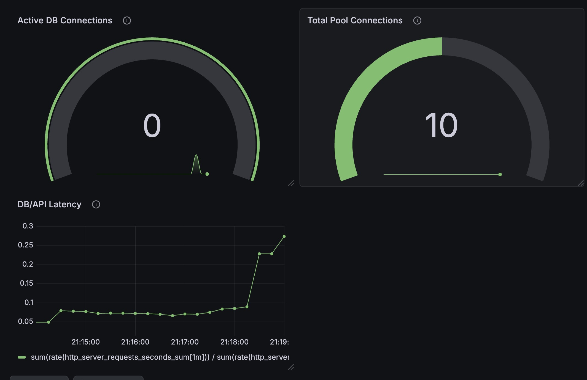
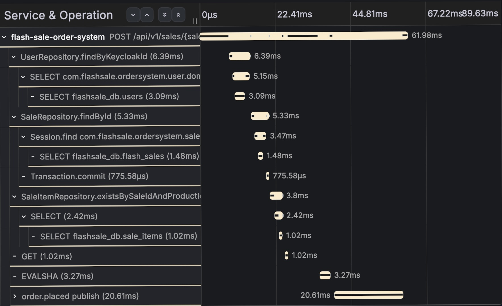

#  Observability & Monitoring

This document describes the monitoring, alerting, metrics collection, and distributed tracing setup used in the Flash Sale System.

The observability stack was used to:

- Monitor infrastructure health
- Analyze system bottlenecks
- Track asynchronous workflows
- Investigate latency spikes
- Observe Kafka processing behavior
- Improve system stability under load

---

#  Observability Stack

The system integrates:

- Prometheus
- Grafana
- OpenTelemetry
- Tempo

for metrics collection, monitoring, alerting, and distributed tracing.

---

#  Metrics Collection

Prometheus is used for metrics scraping and aggregation across application and infrastructure components.

Collected metrics include:

- API latency
- Request throughput
- Error rates
- JVM metrics
- CPU utilization
- Kafka processing metrics
- Database performance metrics
- Business-level purchase metrics

---

#  Grafana Dashboards

Grafana dashboards were used during load testing and operational analysis to monitor both infrastructure health and business behavior.

---

# 1. System Health Dashboard

The system-health dashboard monitored core application and infrastructure metrics including:

- Requests per second (RPS)
- API latency
- Error rate
- CPU utilization
- JVM memory usage
- P95 latency
- Active threads
- Garbage collection activity

---

# 2. Business Metrics Dashboard

Business-level dashboards were used to observe flash-sale behavior under concurrency.

Tracked metrics included:

- Purchase success count
- Purchase failure count
- Out-of-stock requests
- Inventory restoration count
- Success-to-request ratio
- Purchase processing latency

---

# 3. Kafka Monitoring Dashboard

Kafka dashboards were used to monitor asynchronous processing behavior.

Tracked metrics included:

- Producer failures
- Consumer failures
- Consumer processing latency
- Event throughput

---

# 4. PostgreSQL Monitoring Dashboard

Database dashboards were used to analyze persistence-layer behavior under concurrent load.

Tracked metrics included:

- Database latency
- Active database connections
- Total database connections

---

#  Distributed Tracing

OpenTelemetry instrumentation was integrated across asynchronous request-processing workflows.

Tempo was used for trace aggregation and visualization.

---

## Tracing Use Cases

Distributed tracing was used to analyze:

- API request flow
- Kafka event processing
- Retry workflows
- Asynchronous order handling
- Latency bottlenecks during concurrency spikes

---

## Trace Visualization

Tracing analysis helped identify latency spikes caused by repeated sale-data fetching under high concurrency.

This later led to Redis cache optimization for hot-path sale data.

---

#  Alerting

Grafana alerting was configured for critical operational conditions.

---

## Configured Alerts

### Infrastructure Alerts

- JVM memory usage > 80%
- API latency > 2 seconds

---

### Kafka Processing Alerts

Alerts were configured for Kafka consumer-processing failures and operational instability.

Critical alerts were configured to notify the administrator through email-based alerting workflows.

---

#  Operational Insights

Observability tooling was heavily used during load testing and bottleneck analysis.

Key findings included:

- CPU saturation during retry-heavy traffic
- Thread contention under burst concurrency
- Increased latency during repeated sale-data fetching
- Kafka buffering effectiveness during spikes

These findings later guided improvements including:

- Redis cache optimization
- Rate limiting

---

#  Summary

The observability stack provided visibility into:

- infrastructure behavior
- asynchronous processing
- retry workflows
- Kafka event processing
- latency bottlenecks
- business-level flash-sale behavior
- system stability under concurrency

The integration of metrics, dashboards, tracing, and alerting significantly improved debugging, bottleneck analysis, and operational visibility during high-concurrency testing.