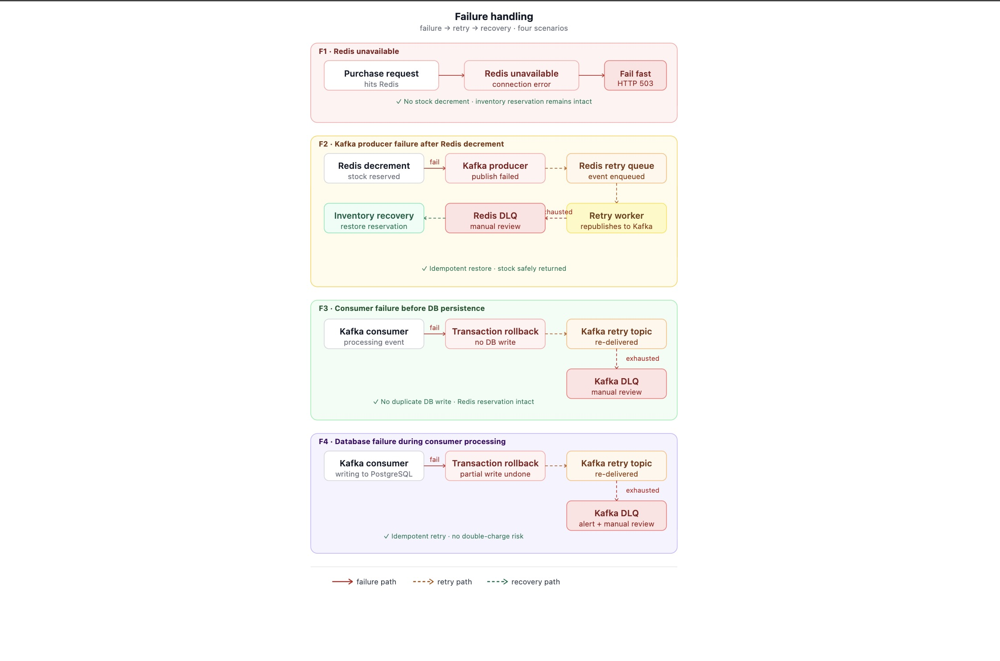
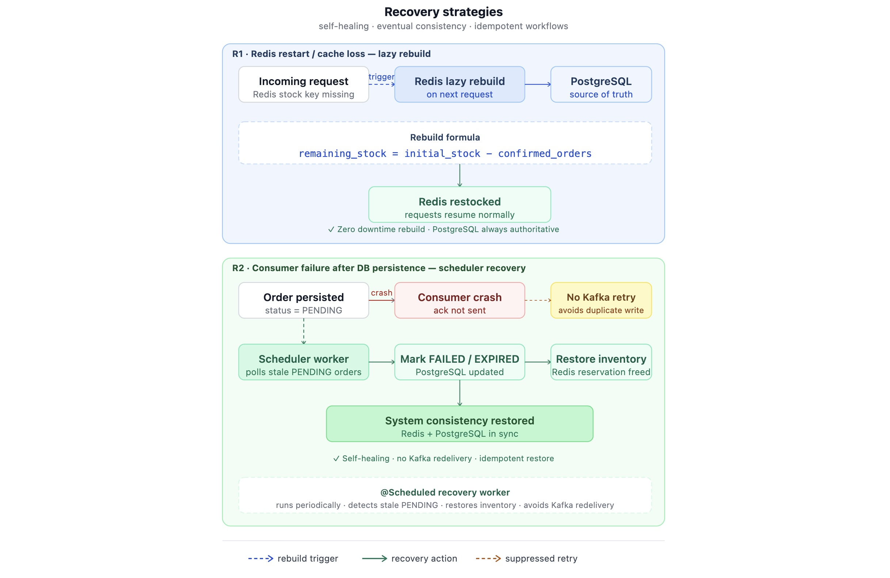

# 🔥 Recovery Strategy

This document describes the retry workflows, failure handling mechanisms, idempotency protections, and recovery orchestration used in the Flash Sale System.

The recovery architecture is designed to preserve:

- Inventory correctness
- Event consistency
- Order integrity
- System stability during failures

while operating under high-concurrency asynchronous workloads.

---

# 📌 Recovery Overview

The system includes multiple recovery workflows to handle:

- Kafka publish failures
- Consumer processing failures
- Partial infrastructure failures
- Duplicate event execution
- Redis restart scenarios

Recovery architecture combines:

- Retry queues
- Dead Letter Queues (DLQ)
- Compensation workflows
- Scheduler-driven recovery
- Idempotent event processing

---

## Failure Handling Paths



---

# 📨 Producer Failure Recovery

## Problem

Inventory reservation may succeed in Redis while Kafka event publication fails.

This creates a dangerous state:

```text
inventory decremented
BUT
event not published
```

Without recovery, inventory becomes inconsistent.

---

## Recovery Flow

### Step 1 — Retry Queue

Transient Kafka publish failures are retried automatically.

Examples include:

- Temporary broker unavailability
- Short-lived network interruptions
- Infrastructure instability

---

### Step 2 — Redis-backed DLQ

If retries fail repeatedly:

- Event moved to Redis-backed producer DLQ
- Recovery scheduler processes failed events later

---

### Step 3 — Inventory Restoration

If failed events cannot be recovered successfully after retry attempts, scheduler-driven recovery workflows restore inventory safely.

```text
inventory += reserved_stock
```

This prevents permanent stock loss.

---

# 📨 Consumer Failure Recovery

## Problem

Kafka consumers may fail during asynchronous order processing.

Examples include:

- Database failures
- Transaction failures
- Infrastructure interruptions
- Unexpected processing exceptions

---

## Recovery Flow

### Step 1 — Kafka Retry

Failed events are retried automatically.

Transient failures are often resolved during retry attempts.

---

### Step 2 — Kafka Dead Letter Queue (DLQ)

Repeatedly failing events are moved to Kafka DLQ for later recovery.

---

### Step 3 — Recovery Scheduler

Background recovery jobs inspect failed events and attempt safe reprocessing.

---

# 🔁 Idempotent Recovery Protection

Retries and recovery workflows must not execute the same event multiple times.

## Event Tracking

Processed events are tracked using persistent database event records.

This ensures:

- Events processed only once
- Safe retry execution
- Duplicate-safe recovery
- Consistent compensation behavior

---

## Why This Matters

Without idempotency protection:

```text
retry → duplicate processing
```

could create:

- Multiple orders
- Multiple compensations
- Incorrect inventory restoration

---

# ⚖️ Compensation-Based Consistency

The system follows an eventual consistency model.

Temporary inconsistencies are resolved using asynchronous recovery workflows.

---

## Inventory Restoration Flow

If inventory reservation succeeds but order persistence fails permanently:

```text
inventory += reserved_stock
```

Inventory is restored safely to Redis.

---

# ♻️ Redis Recovery Strategy

Redis is treated as an ephemeral high-performance concurrency layer rather than a persistent source of truth.

PostgreSQL remains the authoritative source of inventory correctness.


## Recovery Strategies



---

## Startup Recovery

If Redis inventory data becomes unavailable after restart or cache loss, inventory state is rebuilt using persisted order data.

Recovery calculation:

```text
remaining_stock = initial_stock - confirmed_orders
```

This restores inventory consistency after:

- Redis restart
- Cache eviction
- Infrastructure recovery scenarios

---

# ⏱️ Scheduler-Based Recovery Jobs

Spring Scheduler is used for background recovery workflows.

Schedulers handle:

- Failed producer recovery
- DLQ inspection
- Pending order expiration
- Inventory restoration workflows

This prevents failed events from remaining permanently unresolved.

---

# 🚦 Failure Isolation

Recovery workflows are intentionally isolated from the main request path.

This improves:

- API responsiveness
- System stability
- Failure containment
- Throughput under load

The API layer remains lightweight while recovery executes asynchronously.

---

# 📊 Operational Benefits

The recovery architecture provides:

- Overselling prevention
- Safe retry handling
- Duplicate-safe processing
- Event durability
- Infrastructure fault tolerance
- Inventory consistency preservation

even during partial infrastructure failures.

---

# 📌 Summary

The recovery strategy focuses on maintaining correctness and consistency in a highly concurrent asynchronous environment.

Key reliability mechanisms include:

- Retry workflows
- DLQ handling
- Inventory restoration workflows
- Scheduler-driven recovery
- Idempotent event processing
- Redis rebuild mechanisms

These workflows ensure the system remains resilient during infrastructure and processing failures.